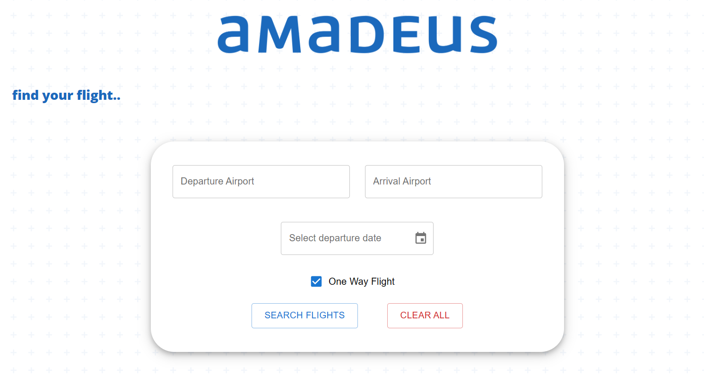

# Screenshots

Select the desired departure and arrival airports or dates:


Autocomplete will make it easier for you:


Or check if it's a one way flight.



And see the available fligts:


## Running

Firstly install all the dependencies;

```bash
npm install
```

Then start the local server using json data on any desired port, but make sure it won't work on the same default port as the app itself(it's usually 3000);

```bash
 npx json-server db.json --port 3001
```

After that run:

```bash
npm start
```

You're good to go!
Please reach me if you have any qeustions.
